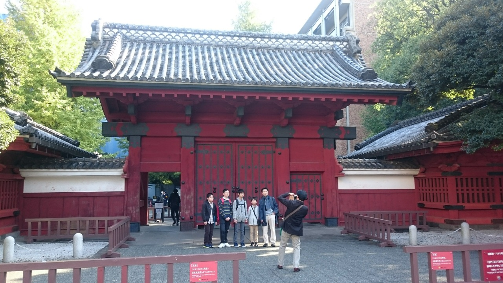
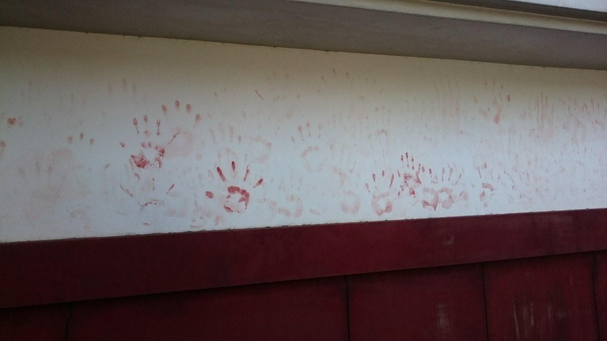
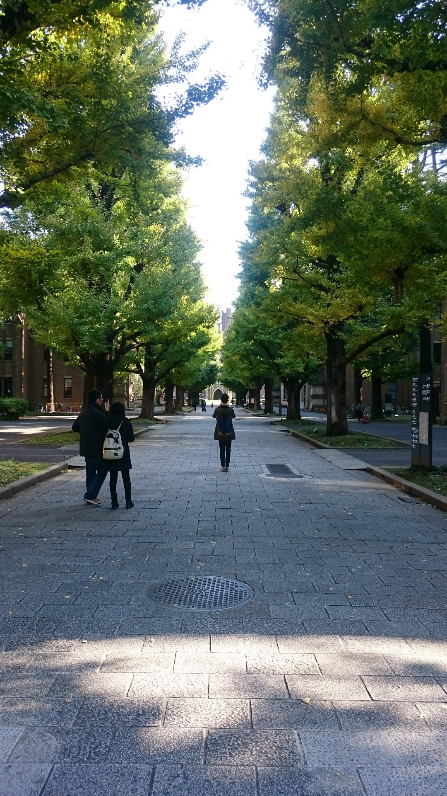
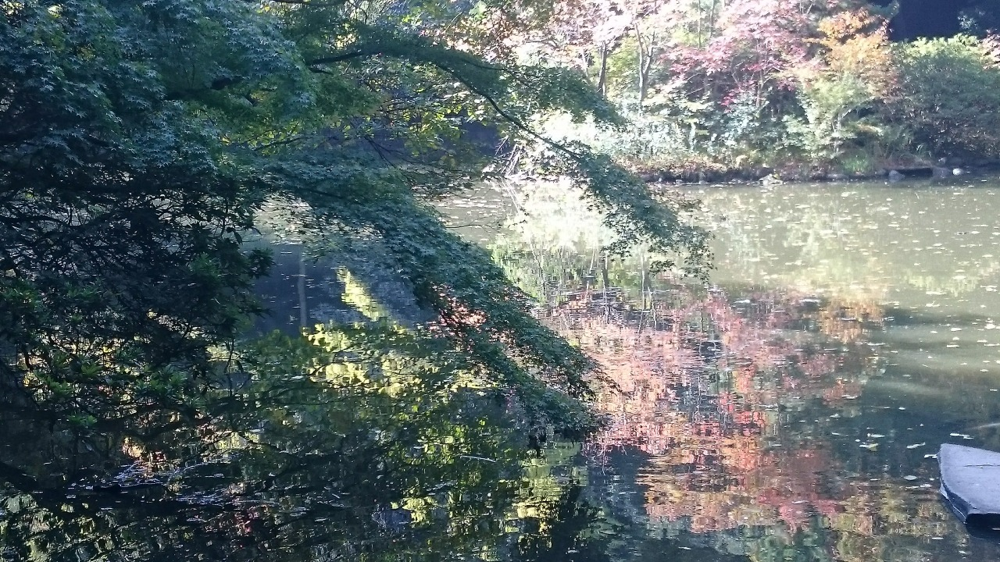
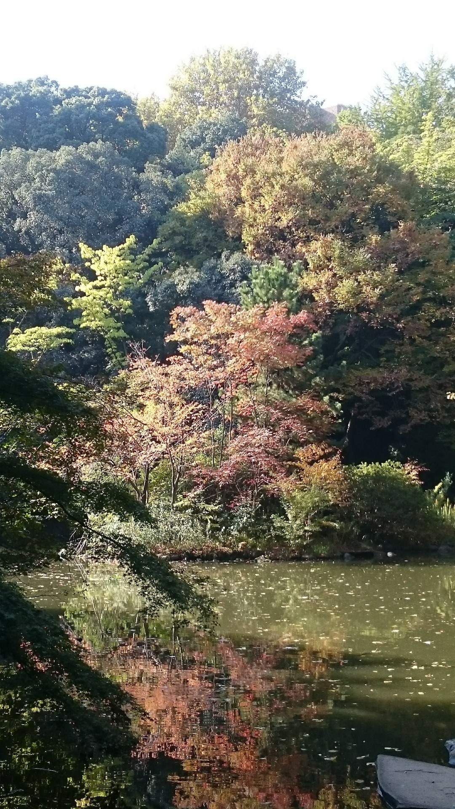
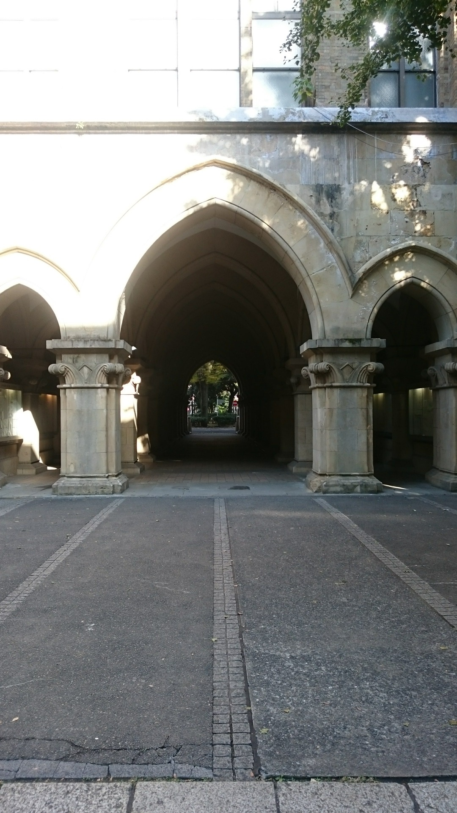
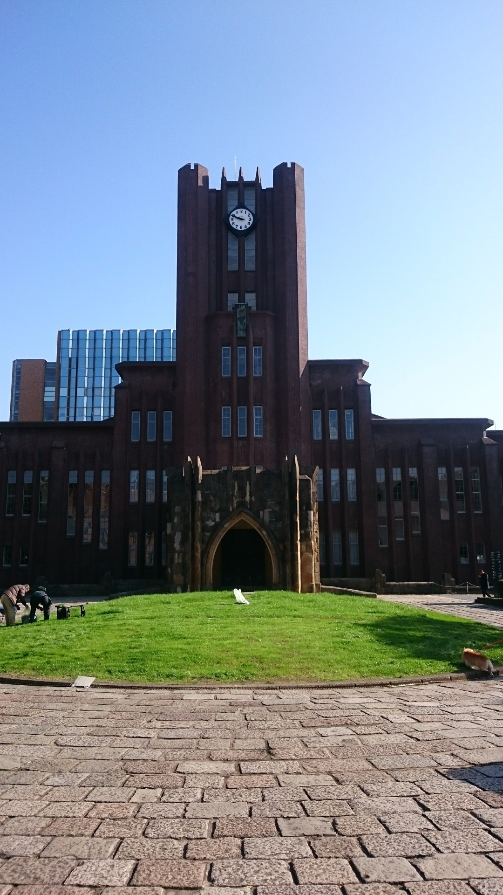
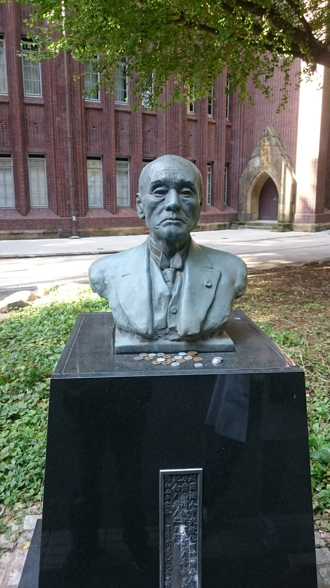
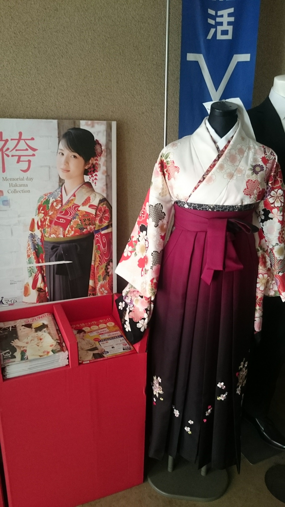

最上面那張照片是東大有名的紅門，和其他大門比，真的比較特別，但不知道是歷史的淵源，還是因為好看而有名，我對旁邊的牆壁還比較有興趣。

這個猛吧～應該是油漆未乾時有人在這裡留下的，朋友說還蠻恐怖的，忽然想起來神雕俠侶的李莫愁，他要殺人，都會用血手印做殺人預告，一個手印就是殺一個，這裡不知道要殺幾個...

嗚嗚嗚，好美的校園喔！～怎麼我校都沒有這麼漂亮，走到旁邊都只有建築物，沒啥樹。

U see ~

不過我比較喜歡花蓮東華大學的湖，東華大學地景真的大推，不過真的希望能在裡面開車或者騎腳踏車，那個校園真的有夠大...

日本的東京大學裡面真的很多這樣的拱門，覺得很像國外的大學（啊現在不就是國外的大學），應該說是很像印相中羅馬那種建築，不知道有生之年有沒有辦法去看看。

這鐘樓也很猛，一個圓形廣場的概念，真的比我校好看多了，旁邊剛好有人在除草，可是有一名年輕人很像是學生，不知道是愛校服務還是啥？

逛下來，覺得這個最令我不解，銅像前面有很多零錢是什麼概念？這些都不是我放的喔，是經過時就看到，最令我驚訝的是，google 都找不到原因，這真的太神啦～竟然有 Google 不知道的事情！！！

最後放上東京大學的畢業服？！看漢字猜，應該是畢業服沒錯，一套要價 50000日幣！而且應該是用租的吧...這要價不斐阿...可是真的好看，如果上面只白色，裙擺都是紅色，就是巫女服啦～讚

考上東京大學真的是一定值得放鞭炮慶祝的事情，因為後來去逛他們的員生社，很多東西都有在做入學紀念，像是入學紀念酒、入學紀念鐘等等，一個中國女兒紅的概念嗎？只是四年溫存不知道溫存的夠不夠？
